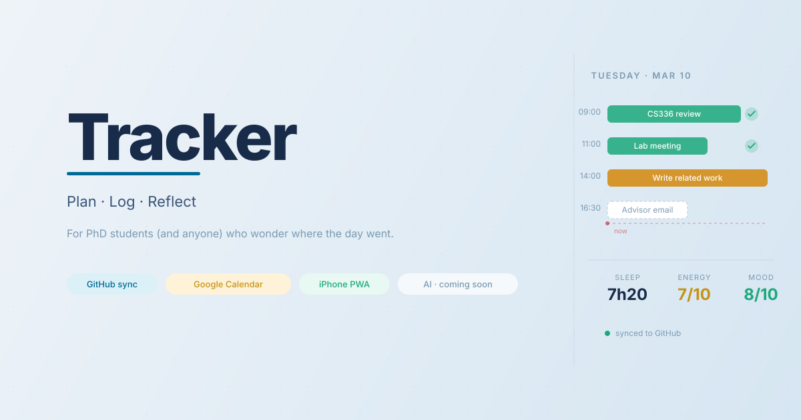

I built this for myself as a PhD student who constantly wonders where the day went. Planning what I want to do, then logging what I actually did, helps me feel less like time is just slipping by. Data stays in my own private GitHub repo. Sharing it in case it's useful for you too.

## Features

- **Daily View**: Two-column layout — timeline on the left, structured check-ins on the right
  - **Morning Check-in**: Sleep/wake times + 4 morning ratings (Sleep Quality, Sharpness, Mood, Body), morning note
  - **Vitals**: Naps, Exercise, Meals, Drinks & Snacks, free-form notes — auto-populated from timeline events by tag group
  - **Night Check-in**: 4 evening ratings (Focus, Social, Mood, Body), night note
- **Stats View**: Charts across the last 7 / 30 / 90 days — sleep duration, task completion, all 8 ratings, exercise activity, drinks log. Summary cards include avg sleep (mean ± std), bed time (mean ± std), night mood, night focus, exercise days, task completion rate.
- **Projects View**: Create and manage projects with name, color, and description. See per-project task counts, completion rate, and recent task history across the last 90 days.
- **GitHub Sync**: Data stored in a private GitHub repo, synced on demand
- **Google Calendar Import**: Import today's events as planned tasks (optional)
- **Timeline**: Visual task timeline with drag-to-schedule support
- **Cross-device**: Works on Mac (browser) and iPhone (PWA, full offline support)

## Quick Start

### 1. Create a GitHub repo as your private database

1. Go to [github.com/new](https://github.com/new)
2. Create a **private** repository (e.g., `my-journal-data`)
3. Leave it empty (no README, .gitignore, or license)

### 2. Generate a Personal Access Token

1. Go to [github.com/settings/tokens](https://github.com/settings/tokens)
2. Generate new token (classic)
3. Select scope: `repo` (Full control of private repositories)
4. Copy the token (starts with `ghp_`)

### 3. Run the app locally

```bash
cd /path/to/Tracker

# Python (built-in)
python3 -m http.server 8080
```

Then open [http://localhost:8080](http://localhost:8080), enter your GitHub token and repo details, and start tracking.

## Access on iPhone

Deploy the app so it's reachable over the internet, then install it as a PWA on your phone.

**Option A: GitHub Pages**
1. Push this repo to GitHub
2. Go to Settings → Pages → Deploy from main branch
3. Access via `https://yourusername.github.io/tracker/`

**Option B: Vercel**
1. Connect repo to [vercel.com](https://vercel.com)
2. Deploy automatically
3. Access via your Vercel URL

**Install as PWA on iPhone**
1. Open the deployed URL in Safari
2. Tap Share → Add to Home Screen
3. Name it "Tracker"

The app works fully offline after the first load — changes sync to GitHub whenever you're back online.

## Google Calendar Import

**Create a Google Client ID**

1. Go to [console.cloud.google.com](https://console.cloud.google.com) — sign in with a **personal Google account** (school/work accounts may block OAuth credential creation)
2. Create a project → **APIs & Services → Enable APIs** → enable **Google Calendar API**
3. **APIs & Services → Credentials → Create Credentials → OAuth 2.0 Client ID**
   - Application type: **Web application**
   - Authorized JavaScript origins: add your app URL (e.g. `http://localhost:8080` or your deployed URL)
   - Leave redirect URIs empty
4. Copy the **Client ID** (ends in `.apps.googleusercontent.com`)
5. In Tracker → **Settings** → paste it into **Google Client ID** → Save

**Importing events**

1. Navigate to the day you want to import events for
2. Click **↕ Import** next to the Planned tasks section
3. On first use, click **Connect Google Calendar** and sign in
4. Events for the current day load automatically — check which to import → **Import Selected**

Re-importing the same event updates its calendar fields while preserving any notes you've added.

## Tag Groups

Tag groups categorize tasks so the app can auto-populate the Vitals sections in the Daily view. Manage them in **Settings → Tags**.

On first launch, three groups are seeded automatically:

| Group | Purpose | Default tags |
|-------|---------|--------------|
| **Meal** | Auto-fills Meals module | Breakfast, Lunch, Dinner |
| **Exercise** | Auto-fills Exercise module | Gym, Run, Walk, Swim, Bike, Yoga |
| **Misc** | Misc tags (Nap auto-fills Naps module) | Nap |

Any task tagged with a group's tag will appear in the corresponding Vitals module, with its notes shown inline.

## File Structure

```
Tracker/
├── index.html              # Main app
├── css/style.css           # Styles
├── js/
│   ├── app.js              # Main controller
│   ├── github.js           # GitHub API wrapper
│   ├── storage.js          # localStorage + sync
│   ├── utils.js            # Helpers
│   ├── markdown-editor.js  # Markdown editor component
│   └── views/
│       ├── daily.js        # Daily view
│       ├── stats.js        # Stats view (charts)
│       └── projects.js     # Projects view
├── sw.js                   # Service worker (offline)
├── manifest.json           # PWA manifest
├── icons/                  # App icons
├── DESIGN.md               # Design document
└── README.md               # This file
```

## Data Storage

Your data is stored in your private GitHub repo:

```
data/
├── 2026/
│   ├── 01.json         # January daily entries
│   ├── 02.json         # February daily entries
│   └── ...
└── config.json         # App config (tag groups, projects, Google Client ID)
```

## Data Schema

### Daily Entry

```json
{
  "planned": [
    {
      "id": "t1abc123",
      "text": "CS336 Assignment",
      "scheduledTime": "09:00",
      "duration": "2h",
      "status": "not-started | in-progress | done | cancelled",
      "notes": "Optional markdown notes",
      "tagIds": ["tag-id"],
      "projectIds": ["proj-id"],
      "importedFrom": "gcal",
      "gcalEventId": "abc123@google.com",
      "gcalDescription": "Read-only description from Google Calendar"
    }
  ],
  "log": [
    {
      "id": "t2def456",
      "text": "Unexpected meeting",
      "time": "14:00",
      "duration": "30m",
      "notes": ""
    }
  ],
  "sleep": {
    "bedTime": "23:00",
    "wakeTime": "07:30",
    "naps": [{ "id": "n1", "time": "13:00", "duration": "25m" }]
  },
  "morning": {
    "quality": 4,
    "clarity": 3,
    "mood": 4,
    "fatigue": 3
  },
  "night": {
    "focus": 4,
    "social": 3,
    "mood": 4,
    "body": 3
  },
  "morningMessage": "Ready for a productive day.",
  "nightMessage": "Good but tiring day.",
  "meals": [
    { "id": "m1", "name": "Oatmeal", "time": "08:00", "type": "meal" },
    { "id": "d1", "name": "Coffee", "type": "drink" }
  ],
  "exercise": [
    { "id": "e1", "time": "07:00", "name": "Gym", "duration": "45m" }
  ],
  "dayNotes": "Free-form markdown notes for the day."
}
```

**Planned tasks** are added in the morning with an optional scheduled time and duration. Status tracks progress throughout the day.
**Log tasks** are ad-hoc entries added as things happen.
**morning / night** ratings are 1–5 integers (higher = better for all fields).
**meals** stores both food and drink items, distinguished by `type: "meal" | "drink"`.
**exercise** stores manually added exercise sessions; tag-based auto-pull also shows exercise-tagged tasks inline.

## Security

- Data stored in your private GitHub repo
- GitHub token stored in browser localStorage (never sent elsewhere)
- All sync over HTTPS
- No backend server

## License

MIT
